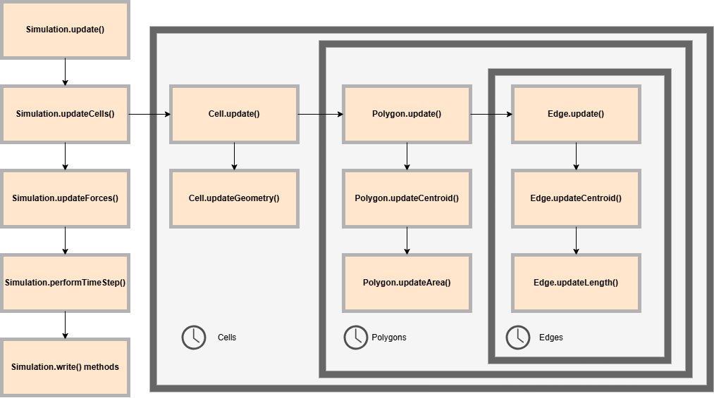

# SingleCell3D
This repository consists of simulation code and helper scripts used to simulate single cell migration in 3D using a Vertex model approach.

## How To Run
Before compiling the program, ensure that the initial configuration and simulation parameters (see `main.cpp`) are configured for your liking.

Ensure \SingleCell3D is the working directory. Build the program using 
- `make` with `Makefile.txt` 

or
- `g++ -o main.exe main.cpp Simulation.cpp Vertex.cpp Edge.cpp Polygon.cpp Cell.cpp`

Note: Both of these methods to compile the program assume you are using g++ as your compiler. To use a different C++ compiler you will have to edit the makefile/one-line bash script above.  

Run the program using `.\main.exe`

## C++ Simulation Code

### `main.cpp`

Generates the initial configuration from specified .vtk file in `vtk_in/`, assigns simulation parameters and runs the simulation.

`bool batchMode` specifies if multiple simulations should be run at once. If true, this is currently set up for 2D parameter scans. If false, a single simulation is performed with specified parameters.

### `Simulation.cpp`

#### Constructor

To construct an instance of Simulation, you must pass the constructor vectors of pointers for all Cells Polygons Edges and Vertices.

`int period` is the period of the oscillations in timesteps.

`double timestep` is the length of one timestep $\Delta t$.

`int numTimesteps` is teh total number of timesteps to run.

`int log` is the number of timesteps at which the simulation should write. 1=every timestep, 10 = every ten timesteps, etc. 

`bool write` can be toggled on/off to write results or run simulation (helpful for debugging).

#### Simulation Scheme

The following simulation scheme is implemented every timestep:

where the arrows demonstrate the order of function calls and the frames demonstrate the looping structure. Rightward  function call branches are completed before downward calls are made. 

#### Aditional settings

`bool boundary_` defaults true, specifies whether to simulate the cells with a stiff boundary preventing vertex motion in the -z direction. Can be updated using `Simulation.setBoundary()`.

`int midsteps_` defaults 0, is the number of simulation pseudo-timesteps to run between each timestep to better allow the system to relax into an energetic minimum given any time-dependent forces before updating the simulation time. Can be updated using `Simulation.setMidsteps()`.

## Python Scripts

### `plotData.py`

This script plots the Area, Volume, Centroid, and MaxForce of a single cell over time. 

### `inlaid_vol_area_plotter.py`

This script plots the area over time of a single cell inlaid in the plot of the volume over time. 

### `platonic_solids.py`

This script generates the platonic solids (tetrahedron, cube, octahedron, icosahedron, dodecahedron) in vtk file format to be used as an initial configuration. 

### `midstepsAnalysis.py`

This script plots the maximum force recorded across any vertex over a number of pseudo timesteps run for a given timestep. Multiple timesteps are sampled and plotted together.

### `2Dscanplotter.py`

This script generates a colour plot of the displacement of a cell given a 2D parameter sweep of the facial oscillating boudnary tension, $\gamma_0$, and the oscillatory period. 

### `2DScanplotterGeneric.py`
This script generates a colour plot of the displacement of a cell given a 2D parameter sweep of any two parameters. The parameter sweep must follow a standard double loop where both parameters are being incremented as in the  `main.cpp` `batchmode==true` loop. The script must also set the range and increment of both parameters.  

### `formatEqn.py`
This script takes as input the force terms from `Force_derivation.m` and reformats the equation in C++ compatible expressions. (Note that currently, there are two square roots per equation that must be reformatted manually!)

## Matlab Scripts

### `Force_derivation.m`
This script symbolically derives the volume and area derivatives with respect to vertex position. 

### `kronnecker_delta.m`
This script implements the kronnecker delta on a symbolic matlab equation by performing a substitution of variables. It must be passed the old variables (eg. i, j) and the new variables (eg. k, kp1, if implementing $\delta_{ik}$). It is used in combination with `Force_derivation.m`.

